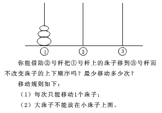
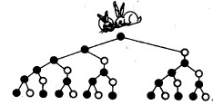
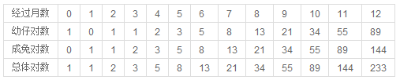

经典递归问题
============

递归满足2个条件:

1. 调用自身
2. 递归出口

## 阶乘

n! = n * (n-1) * (n-2) * ... * 1(n > 0)

```
int recursive(int n)
{
    if (n == 0) {
        return 1;
    }
    else {
        return n * recursive(n-1);
    }
}
```

## 汉诺塔问题

问题描述:



```
void hanoi(int n,int p1,int p2,int p3)
{
    if(n == 1)
        cout<<"盘子从"<<p1<<"移到"<<p3<<endl;
    else
    {
        hanoi(n-1, p1, p3, p2);
        cout << "盘子从" << p1 << "移到" << p3 << endl;
        hanoi(n-1, p2, p1, p3) ;
    }
}
```

### 全排列

从n个不同元素中任取m（m≤n）个元素，按照一定的顺序排列起来，叫做从n个不同元素中取出m个元素的一个排列。当m=n时所有的排列情况叫全排列。

  如1,2,3三个元素的全排列为：

  1,2,3
  1,3,2
  2,1,3
  2,3,1
  3,1,2
  3,2,1 

```
inline void swap(int &a, int &b)
{
    int temp = a;
    a = b;
    b = tem;
}

void perm(int list[], int k, int m)
{
    if (k == m)
    {
        for (int i = 0; i < m; i++)
        {
            cout << list[i];
        }
        cout << endl;
    }
    else
    {
        for (int i = k; i < m; i++)
        {
            swap(list[k], list[i]);
            perm(list, k + 1, m);
            swap(list[k], list[i]);
        }
    }
}
```

### 斐波那契数列

斐波纳契数列，又称黄金分割数列，指的是这样一个数列：1、1、2、3、5、8、13、21、…… 这个数列从第三项开始，每一项都等于前两项之和.

有趣的兔子问题:



一般而言，兔子在出生两个月后，就有繁殖能力，一对兔子每个月能生出一对小兔子来。如果所有兔子都不死，那么一年以后可以繁殖多少对兔子？

  分析如下：

第一个月小兔子没有繁殖能力，所以还是一对；

两个月后，生下一对小兔子，总数共有两对；

三个月以后，老兔子又生下一对，因为小兔子还没有繁殖能力，总数共是三对；

……　

依次类推可以列出下表：


```
long fib(int n)
{
    if (n == 0) {
        return 0;
    }
    if (n == 1) {
        return 1;
    }
    if (n > 1) {
        return fib(n-1) + fib(n-2);
    }
}
```
