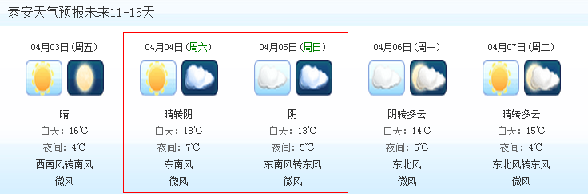

2015年清明节泰山之行安排
========================

### 1. 清明节泰安天气

泰山15天天气预报:

> 4月4日和5日气温比较低,可以多带一个稍微厚点的外套

### 2. 出发前准备

记得带身份证(**这个最重要**)

1. 出发时间

    去泰山的车票已经买上(2015-04-04 车次G111 北京南08:40 --> 泰安10:38) 早上8点在北京南站集合,可以吃早餐.

2. 背包, 装自己常用装备(只带必要的,登山沉)

3. ~~最好带一把伞,以防有雨~~

4. ~~手套(家里有就带上,没有就直接去泰山买,不贵)~~

5. 不要带食物(去泰安火车上吃的除外)

### 3. **住宿(重要)**

### 4. **登山(重要)**

出于百度网友给出的建议,我们这次就不去看日出了,这样我们就精力充沛,白天可以玩得很嗨,时间也很充足,拍照留念也不会有黑眼圈(^_^)

下面的评论来自百度:

> 非常不建议在晚上登山,一则危险,二则看不到沿途的风景。虽然一路都有路灯,但其实作用不大,深一脚浅一脚,非常容易摔倒。
  另外,沿途的很多景点也许早就关门了。上次我去泰山,本来想去岱庙,结果六点就关门. 很多人登泰山是为了看日出,但是就应为一个日出,
  错过了沿途多少美丽的风景呢?要是晚上去登山,带上数码相机也没什么用。

和一个朋友打听,游泰山不需要太多的时间,我们这次是上午11点左右到达泰安,但是为了能玩得尽兴,当天也就是**04月04日**,我们不去爬山,
用下午的时间去泰安的其他得方逛一逛,品尝一下正宗的鲁菜,采购第二天的食物和用具,当天就在泰安玩儿半天(打牌,K歌,吃喝),
当然还可以买一些小玩意儿,纪念品什么的

第二天(04月05日)早上去爬山,用一天的时间游览泰山,**随性而至,随性而归**^_^, **任性**

+ 登山前准备

    * 提前购买食物和水,水每人最多两瓶(百度经验),路上也会有卖水的

        食物买一些好吃的,尽量不要在山上买,据说(百度经验)山上的东西超级难吃

    * ~~手套~~

    * 爬山时间是4月5号早上9点(9点开始爬山,不是9点从宾馆出发)

+ 线路

    上山:

    爬泰山路线有很多,我们选择最经典的登山路线--红门游览线,据说是皇帝的登山御道,在中天门处可以休息,然后爬泰山最艰苦的泰山
    十八盘(这里会有索道,我们就放弃索道了),就从这条路线登顶

    下山:

    据一个朋友说,爬泰山上去容易下来难,据本人的经验,登山向来如此,所以我们下山看情况而定:如果不想走路,乘索道下来;如果不想乘索道,
    找一条另外的路线下来,不想走重复的路.

### 5. 吃 ^-^

### 6. 返回

